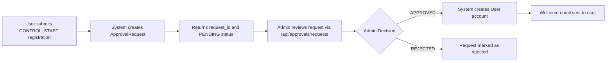

# Control Dashboard API Implementation

This document describes the implementation of the Control Dashboard APIs with approval workflow for CONTROL_STAFF registration.

## Overview

The system now includes:

1. **CONTROL_ADMIN Role** - Can approve/reject CONTROL_STAFF registration requests
2. **Approval Workflow** - CONTROL_STAFF users must be approved by CONTROL_ADMIN before account creation
3. **Personnel Management** - Both CONTROL_ADMIN and CONTROL_STAFF can view all personnel
4. **Approval Management** - Complete CRUD operations for approval requests

## API Endpoints

### 1. Registration Endpoint (Modified)

**POST** `/api/accounts/register`

#### Behavior Changes:

- **CONTROL_STAFF registration**: Creates approval request instead of user account
- **Other roles**: Direct user creation (unchanged)

#### Request Body:

```json
{
  "first_name": "John",
  "last_name": "Doe",
  "email": "john.doe@example.com",
  "password": "TempPassword123!",
  "role": "CONTROL_STAFF",
  "phone_number": "+1234567890",
  "profile_image": null
}
```

#### Response for CONTROL_STAFF:

```json
{
  "message": "Registration request submitted successfully. Please wait for admin approval.",
  "request_id": "648f5a1b2c3d4e5f67890123",
  "status": "PENDING_APPROVAL"
}
```

### 2. Approval Management Endpoints

#### Get All Approval Requests

**GET** `/api/approvals/requests?status_filter={PENDING|APPROVED|REJECTED}`

- **Access**: CONTROL_ADMIN only
- **Query Parameters**:
  - `status_filter` (optional): Filter by approval status

#### Get Specific Approval Request

**GET** `/api/approvals/requests/{request_id}`

- **Access**: CONTROL_ADMIN only

#### Process Approval Request

**POST** `/api/approvals/requests/{request_id}/action`

- **Access**: CONTROL_ADMIN only

**Request Body:**

```json
{
  "action": "APPROVED", // or "REJECTED"
  "review_notes": "Application approved - qualifications verified"
}
```

**Response (if approved):**

- Creates user account automatically
- Returns the created user data
- Sends welcome email to the new user

#### Get Pending Requests Count

**GET** `/api/approvals/requests/pending/count`

- **Access**: CONTROL_ADMIN only
- **Returns**: `{"pending_count": 5}`

### 3. Personnel Management Endpoint (New)

#### Get All Personnel

**GET** `/api/control-center/personnel?role_filter={CONTROL_ADMIN|CONTROL_STAFF|DRIVER|REGULATOR}`

- **Access**: CONTROL_ADMIN and CONTROL_STAFF
- **Query Parameters**:
  - `role_filter` (optional): Filter by specific role

**Response:**

```json
[
  {
    "id": "648f5a1b2c3d4e5f67890123",
    "first_name": "John",
    "last_name": "Doe",
    "email": "john.doe@example.com",
    "role": "CONTROL_STAFF",
    "phone_number": "+1234567890",
    "is_active": true,
    "created_at": "2024-01-15T10:30:00Z"
  }
]
```

## Data Models

### ApprovalRequest Model

```python
class ApprovalRequest(BaseDBModel):
    first_name: str
    last_name: str
    email: EmailStr
    phone_number: str
    profile_image: Optional[str] = None
    role: str  # Always "CONTROL_STAFF"
    status: ApprovalStatus = ApprovalStatus.PENDING
    requested_at: datetime
    reviewed_by: Optional[str] = None  # Admin user ID
    reviewed_at: Optional[datetime] = None
    review_notes: Optional[str] = None
```

### ApprovalStatus Enum

```python
class ApprovalStatus(str, Enum):
    PENDING = "PENDING"
    APPROVED = "APPROVED"
    REJECTED = "REJECTED"
```

## Database Collections

### New Collection: `approval_requests`

Stores all CONTROL_STAFF registration approval requests.

### Modified Collection: `users`

- Added `pending_approval` field (boolean) for tracking approval status
- CONTROL_STAFF users created through approval have `pending_approval: false`

## Workflow Process

### 1. CONTROL_STAFF Registration Flow



### 2. Admin Approval Process

```mermaid
graph TD
    A[Admin logs in] --> B[GET /api/approvals/requests]
    B --> C[Review pending requests]
    C --> D[POST /api/approvals/requests/{id}/action]
    D --> E{Action Type}
    E -->|APPROVED| F[User account created automatically]
    E -->|REJECTED| G[Request status updated to REJECTED]
    F --> H[User can now login with temporary password]
```

## Security & Access Control

### Role-Based Access:

- **CONTROL_ADMIN**: Full access to all approval and personnel endpoints
- **CONTROL_STAFF**: Can view personnel, cannot manage approvals
- **Other roles**: No access to control center features

### Authentication:

- All endpoints require valid JWT token
- Role validation enforced at endpoint level
- Database queries filtered by user permissions

## Testing

### Setup Test Environment:

1. Run the FastAPI server
2. Execute `python setup_test_users.py` to create test admin
3. Execute `python test_approval_workflow.py` to test the complete workflow

### Test Scenarios Covered:

- ✅ CONTROL_STAFF registration creates approval request
- ✅ Regular user registration works unchanged
- ✅ Admin can view pending requests
- ✅ Admin can approve requests (creates user account)
- ✅ Admin can reject requests
- ✅ Personnel endpoint returns all staff for authorized users
- ✅ Access control enforced on all endpoints

## Error Handling

### Common Error Responses:

- **400 Bad Request**: Invalid data or request already processed
- **401 Unauthorized**: Missing or invalid authentication
- **403 Forbidden**: Insufficient permissions for requested action
- **404 Not Found**: Approval request or resource not found
- **500 Internal Server Error**: Server-side processing errors

### Validation Rules:

- Email uniqueness enforced across users and pending requests
- Only PENDING requests can be approved/rejected
- Role validation on all endpoints
- Input sanitization and validation on all request bodies

## Email Notifications

### Automated Emails:

1. **Welcome Email**: Sent when CONTROL_STAFF request is approved
2. **Temporary Password**: Generated and included in welcome email
3. **Email Service**: Uses existing email service infrastructure

## Future Enhancements

### Potential Improvements:

1. **Email Notifications**: Notify users when requests are approved/rejected
2. **Batch Approval**: Allow approving multiple requests at once
3. **Approval History**: Track all approval actions with audit trail
4. **Request Comments**: Allow back-and-forth communication during review
5. **Auto-Expiry**: Automatically reject old pending requests
6. **Dashboard UI**: Web interface for managing approvals
7. **Role Hierarchy**: More granular permission management

## Migration Notes

### Existing Data:

- Existing CONTROL_STAFF users are unaffected
- New `pending_approval` field defaults to `false` for existing users
- No breaking changes to existing API endpoints

### Deployment:

- Deploy database schema changes first
- Update application code
- Test approval workflow in staging environment
- Monitor approval request creation and processing
